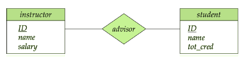
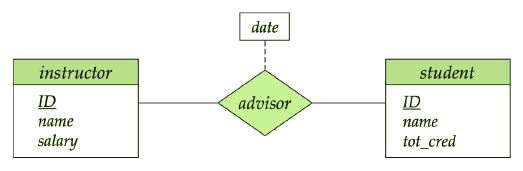
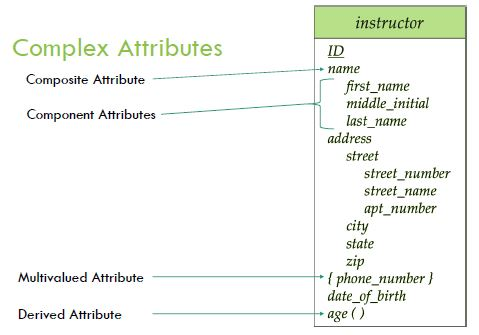
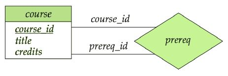
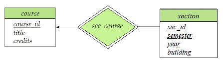
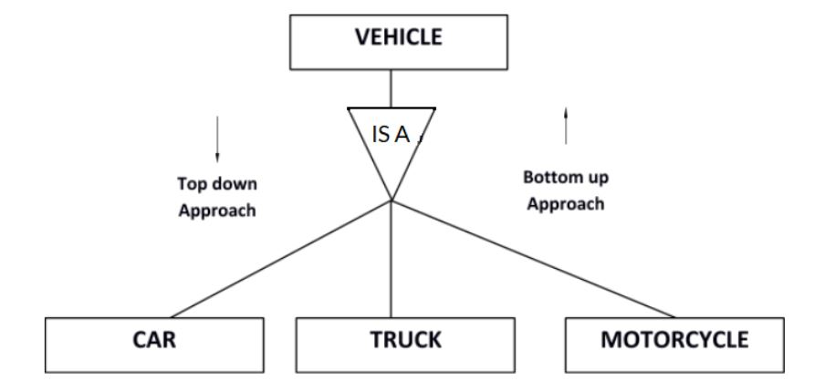

# Entity-Relationship Model

## Modeling
A database model shows the logical structure of a database, including the relationships and constraints that determine how data can be stored and accessed. The main objective of this design process is to avoid redundancy and incompleteness. 
A database can be modeled as a collection of entities[^1] and relationship[^2] among entities

#### Instructor Entity Set
| instructor_id | instructor_name |
|---------------|-----------------|    
| 76766 | Crick |                    
| 45565 | Katz |
| 10101 | Srinivasan |
| 98345 | Kim |
|76543 | Singh |
| 22222 | Einstein |

#### Student Entitty Set
| sudent_ID | student_name |
|-----------|--------------|
| 98988 | Tanaka |
| 12345 | Shankar |
| 00128 | Zhang |
| 76543 | Brown |
| 76653 | Aoi |
| 23121 | Chavez |

| 44553 (Peltier) | advisor | 22222(Einstein) |
|-----------------|---------|-----------------|
|Student entity | Relationship | Instructor entity |
 

An attribute can also be associated with a relationship set

## Degree of a Relationship Set
Binary Relationship
  - Involves two entity sets (or degree two).
  - It is rare to see a relationship involving more than two entity sets, therefore binary relationship set is the commanly used relationship degree.

## Mapping Cardinality Constraints
Cardinality indicate the the number of entites to which another entity can be associated via a relationship set. For a binary relationship set the mapping cardinality must be one of the following types:
  - One to one
  - One to many
  - Many to one
  - Many to many

## Attributes
An entity is represented by a set of attributes, that is descriptive properties possessed by all members of an entity set.
Example :
  - instructor = (ID, name, street, city, salary)  

Domain is the set of permitted values for each attribute
Attribute can be either simple or composite, or Single-valued or multivalued or derived.

- Single Attribute:
  - Eg: first_name
- Composite Attributes
  - Eg: name, which consist of first name, middle name, and last name
- Multivalued Attribute
  - Eg: phone_number
- Derived attribute
  - Eg: age, given date_of_birth

### Attribute Redundancy
An entity should be well defined, thus the attribute redundancy in two or more entities are prevented 
Suppose we have entity sets instructor and department;
- instructor, with attributes: ID, name, dept_name, salary
- department, with attributes: dept_name, building, budget
We can model a relation set **inst_dept** for each instructor to associate with a department. Here the attribute **dept_name** appears in both entity sets. Therefore, when we define the instructor entity set, we should remove dept_name from it, anyways we will reintroduce **dept_name** attribute in the instructor entity when we convert it into tables to establish the relationship. 

### Keys
A **super key** of an entity set is a set of one or more attributes whose values uniquely determine entity. 
- Eg: consider instructor table
  - ID
  - ID, name
 
A **candidate key** of an entity set is a minimal super key
- Eg: consider instructor table
  - ID

 
Although several candidate keys may exist, one of the candidate keys is selected to be the **primary key**

#### Keys for relationship sets
Consider many-to-many relationship set takes between instructor and department, here (ID, dept_name) is the super key. It is also a candidate key and the primary key

## ER Model

An ER model which stands for Entity-Relationship model is describes the interrelation between different entities of the domain of interest with some relation among them. ER model is used to describe the database design of a larger business model visually using several tools and different model types.

First, let's learn about basic ER model design components to better understand the concepts then we will be using crow's foot notation. 

### Basic ER Diagram

 

- Rectangles represent entity sets.
- Attributes listed inside entiry rectangle.
- Underline indicates primary key attributes.
- Diamond represents relationship sets.

There are more constraints that we will see in different conditions. 

#### Relationship Set With Attribute

Consider the above example of the instructor and student entity relationship. In case we need to store the data of when an instructor and student engage in the advisor relation, we can't store them in neither instructor entity set nor in the student entity set, because of the cardinality constraints (one instructor can be in the advisor relation with more than one student and vise versa) and other factors. Therefore, relation set, **advisor** should maintain an attribute, **date**.

 

### Complex Attributes
There are few complex attributes of an entity set which needs to be avoided when designing the ER model.
 
 

#### Composite Attribute
Composite attributes are the non-atomic attributes where each component represents a different meaning alone. Therefore these composite attributes can be flattened into several individual component attributes.

#### Multivalued Attribute
When more than one value can be stored in an attribute then it is called a multivalued attribute. It is not advisable to store multiple values in one attribute, because it will make it hard to query and insert data into the database schema. What we do as a solution is to create a separate schema containing the attributes representing the initial schema (primary key - A) and an attribute(B) for multivalued attribute, where these combined attribute is considered as a candidate key of the new schema.

#### Derived Attribute
When an attribute can be derived from another attribute of the entity set then there is no need to keep the derived attribute in the database unless the derivation involves high computational power. We will cover how it is done during the SQL section.

### Roles
A role is a function that an entity plays in a relationship that is usually not explicitly specified in the ER diagram but they are useful when a relation set requires clarification.
 

 
Here, some courses have prerequisite courses which is indicated by the prereq relation in the diagram. The labels **course_id** and **prereq_id** are called roles. 
Check the video below to understand how to draw the ER-diagram in crow's foot notation. 

https://user-images.githubusercontent.com/84805141/161683285-441db2aa-9472-4f72-94d7-1417a7c150ea.mp4

https://user-images.githubusercontent.com/84805141/161683440-5834d992-6b9b-4192-9005-aa90beeb2162.mp4

----
### Weak Entity Sets
The entity sets which do not have sufficient attributes to form a primary key are known as weak entity sets and the entity sets which have a primary key are known as strong entity sets. The existence of a weak entity set depends on an **identifying entity set**. The relationship between the two entity set is called **identifying relationship** 
Consider an example;
- course = {course_id, title, credits}   here course_id is the primary key of course entity.
- section = {course_id, section_id, semester, year, building}   here (course_id, section_id, semester, year) is the primary key.  

Here course_id is redundant attribute in section entity, but if we remove that, we will not be able to uniquely identify each entity in section entity set. Therefore **section** entity set is called weak entity set and course entity set is called identifying entity set and relationship between course and sction indicates the identifying relationship.  Primary key of a weak entity set is formed by the primary key of the identifying entity set and the discriminator[^3] of the weak entity set.

#### Weak Entity Sets Design
- Identifying relationship is denoted by a double diamond.
- The dsicriminator of a weak entity set is underlined with a dashed line.
  
 

### Extended ER (EER) Feature

The EER model is a high-level data model which incorporates the extension of the ER model. 
- Specialization
- Generalization
- Aggregation

### Specialization
It is a top-down design process where we designate sub-groupings within an entity set that are distinctive from other entities in the set. This is depicted by a triangle component labeled ISA. A lower-level entity set inherits all the attributes and relationship participation of the higher-level entity set to which it is linked.

### Generalization
It is a bottom-up process in which the combination of a number of entity sets that share the same features produce a higher-level entity set. Specialization and generalization are simple inversions of each other; they are represented in an ER diagram in the same way. The term specialization and generalization are used interchangeably.

 

### Aggregation

It represents a relationship between a whole object and its components.

-----
## External Resources
---
1. [The Entity Relationship diagram](https://www2.cs.sfu.ca/CourseCentral/354/zaiane/material/notes/Chapter2/node8.html)
2. [Other Styles of ER diagram](https://www2.cs.sfu.ca/CourseCentral/354/zaiane/material/notes/Chapter2/node9.html)
3. [Reducing ER diagrams to table](https://www2.cs.sfu.ca/CourseCentral/354/zaiane/material/notes/Chapter2/node10.html)
4. [Representation of Strong Entity set](https://www2.cs.sfu.ca/CourseCentral/354/zaiane/material/notes/Chapter2/node11.html)

- You can redirect from the above links to other content from the same site
-----

[^1]:An Entity is an object that exists and is distinguishable from other objects and is represented by a set of attributes. An entity set is a set of entites of the same type that share the same properties.
[^2]:A relationship is an association among several entites. A relationship set is a mathematical relation among n >= 2 entities, each taken from entity sets.
[^3]:The set of attributes that allows distingushing among weak entities is called the discriminator or partial key.
