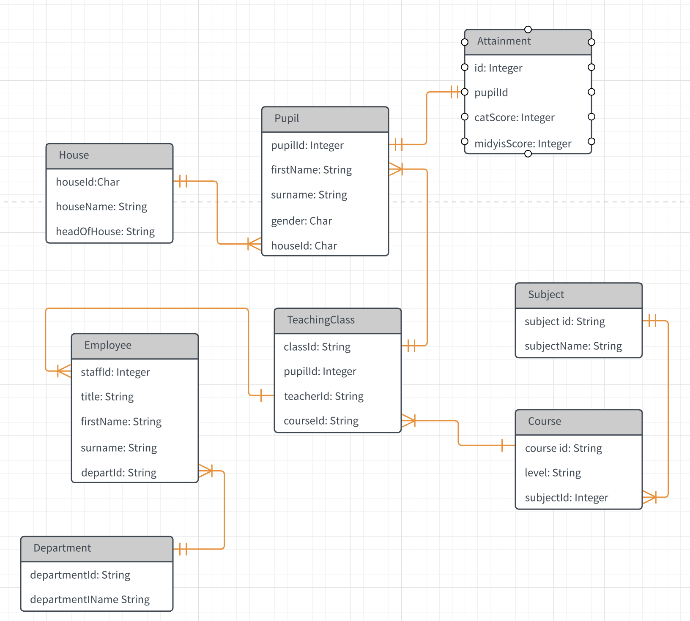

# Structured Query Language (SQL)

**SQL** (Structured Query Language) was developed in the early 1970s at **IBM Research** by a team led by **Dr. Edgar F.Codd**. It was initially known as **SEQUEL** (Structured English Query Language) and later renamed to SQL. Codd's work laid the foundation for the relational model, which revolutionized the way data is stored and managed. 
  
Even though SQL was built for relational databases, it is not exclusively devoted to RDBMS (Relational Database Management Systems). Some **NoSQL** (Non-Relational Databases/Not only SQL), such as **MongoDB** and **CouchDB**, provide their own query languages. 
  
However, many NoSQL databases also offer SQL-like query interfaces or SQL compatibility layers to facilitate data retrieval and manipulation for users who are already familiar with SQL.

### Relational Database
A relational database is a type of database that organizes and stores data in a structured manner, based on the principles of the relational model. In a relational database, data is organized into tables, where each table consists of rows and columns. The relationship between tables is established using keys. It has been widely adopted in various industries and applications where structured data management is essential.  
eg: 
- MySQL
- PostgreSQL

 

### NoSQL
NoSQL is a class of database management system that depart from the traditional relational database model. NoSQL database are designed to handle large volumes of unstructured or semi-structured data, offering scalability and high performance in scenarios where traditional relational database may struggle.   
Even though NoSQL databases offer certain advantages over relational database, they may not suitable for all scenarios. Therefore the choice between NoSQL and relational database depends on the specific requirements of the application and the nature of the data being managed.
  
In this Chapter, we will install and start to use MySQL and work a few SQL queries to get started with MySQL.

### Installing MySQL
 

### Installing MySQL on Windows
- [Download](https://dev.mysql.com/get/Downloads/MySQLInstaller/mysql-installer-community-8.0.33.0.msi) the MySQL installer for Widnows from the official [MySQL website](https://dev.mysql.com/).
- Run the installer and follow the on-screen instructions.
- Choose the setup type and select the components you wan to install.
- Set a root password for the MySQL server during the installation process.
- Complete the installation and ensure that the MySQL service is running.
 

### Installing MySQL in Linux
- Open the terminal and update the package lists: `sudo apt update`
- Install the MySQL server package: `sudo apt install mysql-server`
- During the installation, set a root password for the MySQL server.
- Start the MySQL service: `sudo service mysql start`
- Enable the MySQL service to start on boot: `sudo chkconfig mysql on`
 

### Installing MySQL in macOS
- Download the MySQL community server package for macOS from the official [MySQL website](https://dev.mysql.com/downloads/mysql/).
- Open the downloaded package and follow the installation wizard.
- During the installation, set a root password for the MySQL server.
- Start the MySQL server by launching the **MySQL** application in the **MySQL** folder in the Applications directory.

## Connecting to MySQL
 

### Connecting to MySQL on Windows:
- Open the MySQL Command Line Client or MySQL Workbench.
- Enter the root username and the password set during the installation process.
- Press Enter, and if the credentials are correct, you will be connected to the MySQL server.
 

### Connecting to MySQL on Linux and macOS
- Open the terminal and type `mysql -u root -p` to connect to the MySQL server.
- Enter the root password set during the installation process.
- Press Enter, and if the credentials are correct, you will be connected to the MySQL server.

## SQL queries with MySQL

SQL is a very high level language that works well because it is optimized well. We will look at its building structure in the future.
  
Since SQL is a language, it has its own syntax and semantics.
  
SQL has two distinct categories of commands used to interact with a database; DDL (Data Definition Language) and DML (Data Manipulation Language).
  
DDL is used to define and manage database tables, indexes, constraints and other database objects. DDL commands are responsible for creating, modifying, and deleting database objects.
 
Common DDL commands:
- **CREATE**: Used to create tables, views, indexes, or schemas.
- **ALTER**: Modifies the structure of an existing database objects.
- **DROP**: Deletes a database object, such as dropping a table, view or index.
- **TRUNCATE**: Deletes all data from a table, but keeps the structure intact.
- **RENAME**: Renames a database object, such as renaming a table or a column.

  
DML is used to manipulate or interact with the data stored in the database. DML commands are responsible for inserting, updating, and deleting data in the database.
 
Common DML commands:
- **SELECT**: Retrives data from one or more tables.
- **INSERT**: Adds new data into a table using the INSERT statement.
- **UPDATE**: Modifies existing data in a table.
- **DELETE**: Removes data from a table.

  

### Data Types in SQL

 

1. char(n) : Fixed length character string, with user-specified length n.
2. varchar(n) : Variable length character strings, with user-specified maximum length n.
3. int : Integer
4. smallint : Small integer
5. numeric(p,d) : Fixed point number, with user-specified precision of *p* digits, with *d* digits to the right of decimal point.
6. real, double precision : Floating point and double-precision floating point numbers, with machine-dependent precision.
7. float(n) : Floating point number, with user-specified precision of at least n digits.
  

### sd
